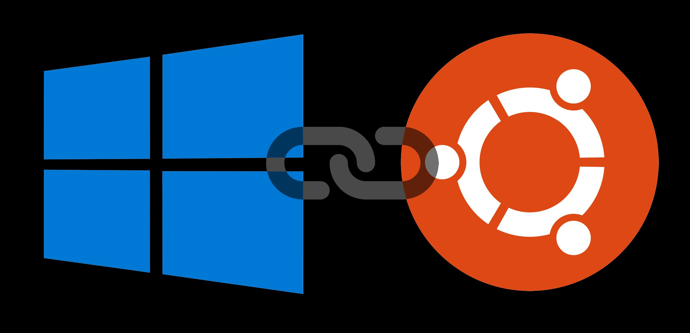

# WSL Link

Allows WSL users to run any CMD commands on host Windows system from within linux subsystem.



# WHY

[StackOverflow Question](https://stackoverflow.com/questions/62085598/linking-windows-commands-inside-windows-subsystem-for-linux-ubuntu)

When doing web development on Windows using [Windows Subsystem for Linux](https://docs.microsoft.com/en-us/windows/wsl/install-win10) you sometimes have to install and run Windows versions of npm packages. This will require you to switch shells and/or terminal application to use node and npm installed on the Windows host.

This package will allow you to link wsl to your host system through `wsl-link` command. You will be able to run your Windows npm applications directly from you WSL shell.

# Requirements

* Windows 10
* WSL
* Node.js
* NPM

> Node and NPM have to be installed both in linux subsystem and on Windows host system.

# Install

> wsl-link has to be installed separately in subsystem and on Windows host

On subsystem linux:
```
npm i wsl-link -g
```
On Windows host:
```
npm i wsl-link -g
```

# Windows Startup

To run script at startup on windows I use PM2 with supplied daemon script.

Install pm2 and pm2-windows-startup on Windows host:
```
npm i pm2 pm2-windows-startup -g
```

Install pm2-startup:
```
pm2-startup install
```

Run wsl-link pm2 daemon:

```
wsl-link-pm2
```

Save pm2 list of processes
```
pm2 save
```

You can now confirm that the wsl-link app is running, with:
```
pm2 status
```


# Usage

On Windows start server (if not using startup setup with pm2):
```
wsl-link
```
Use on subsystem linux (npm -v will be run on host Windows):
```
wsl-link npm -v
```

# Case

On subsystem linux setup a project (or use existing):
```
mkdir wsl-link-test
cd wsl-link-test
touch app.js
npm init
```
app.js:
```
const Nightmare = require('nightmare');

(async () => {
  await Nightmare({
    show: true
  })
  .goto('https://google.com');
})();
```
Install Windows version of Nightmare.js and run it on Windows.

```
wsl-link npm i nightmare --save
wsl-link node app
```
You should see Electron browser open on your Windows host.


# Config

Optionally both Windows and WSL commands will use env vars for host/port configuration.

* Set `WSL_PORT` env to change default port.
* Set `WSL_HOST` env to change default host, ie '127.0.0.1'.

Port and host must be configured to be the same both on WSL and on Windows host.
